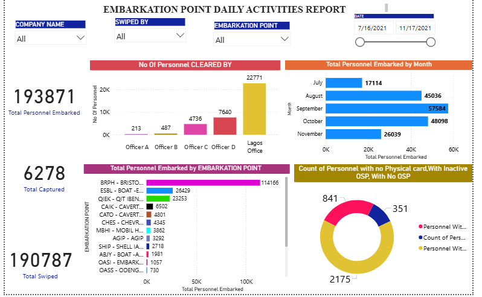
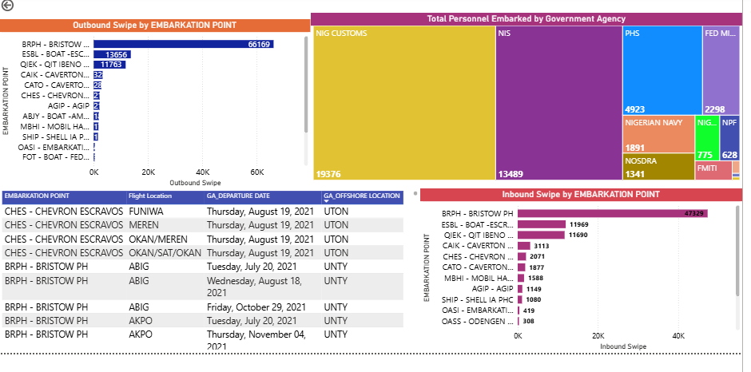

# Offshore Embarkation Activity Report: Nigeria, July to November 2021

**Power BI | Operational reporting | Compliance and access-control analytics**

A Power BI report on **193,871 personnel movements** through at least 13 offshore oil and gas embarkation points in Nigeria between **16 July and 17 November 2021** (125 days). It covers government-agency movements, inbound and outbound swipe records, compliance flags and flight departures.

**My role:** I analysed the embarkation access-control data to bring out insights and presented them to my line manager, covering traffic patterns, compliance gaps and record mismatches, with recommendations for action.

## The business question

Who is moving through the embarkation points, how busy are they, and where are the safety, compliance and record-keeping risks?

The findings were prepared for my line manager, and the report is aimed at operations and HSE (health, safety and environment) managers who need volume, compliance gaps and data-quality problems at a glance.

## Dashboard

## Headline numbers

| Measure | Value |
|---|---|
| Personnel movements | **193,871** (about 1,550 a day) |
| Busiest embarkation point | **BRPH (Bristow PH)**: 114,166 movements, 59% of the total |
| Top three points (BRPH, ESBL, QIEK) | **163,848 movements, 84.5%** |
| Busiest month | **September 2021**: 57,584 |
| Movements with a compliance flag | **3,367 (about 1.7%)**: inactive OSP 2,175, no physical card 841, no OSP 351 |
| Embarked vs swiped | **193,871 vs 190,787: 3,084 records (1.6%) not matched** |

*OSP = Offshore Safety Permit. All figures count movements, not unique people, so one person can appear many times.*

## Key insights

### 1. Three points carry the operation, and one carries most of it
BRPH handled 59% of all movements (66,169 outbound swipes, 47,329 inbound). ESBL (26,429) and QIEK (23,253) are next. Together the top three account for 84.5% of volume, and the other points (CAIK, CATO, CHES, MBHI, AGIP, SHIP and others) share the remaining 15.5%. A disruption at BRPH would affect most of the operation.

### 2. Volume peaked in September, then settled about 20% lower
Monthly totals are not like-for-like, because the window starts on 16 July and ends on 17 November, so July and November are partial months. Per day:

| Month | Embarked | Days in window | Per day |
|---|---|---|---|
| July (from 16th) | 17,114 | 16 | about 1,070 |
| August | 45,036 | 31 | about 1,450 |
| September | 57,584 | 30 | about 1,920 |
| October | 48,098 | 31 | about 1,550 |
| November (to 17th) | 26,039 | 17 | about 1,530 |

September was 28% above August and the clear peak. After that, the daily rate held at about 1,530 to 1,550, roughly 20% below September. So November is not the sharp fall that the monthly totals suggest. It is a plateau.

### 3. Compliance gaps are small in rate but matter for safety
Inactive OSPs (2,175), missing physical cards (841) and missing OSPs (351) add up to 3,367 flagged movements, about **1.7%**. That is an upper bound, since one movement could carry more than one flag. Even at that rate, every flagged movement is a person who reached an embarkation point without valid credentials, so the gate controls are worth tightening.

### 4. Government-agency personnel make up about a quarter of movements
The agency view shows NIG Customs (19,376), NIS (13,489), PHS (4,923), a Federal Ministry body (2,298), the Nigerian Navy (1,891), NOSDRA (1,341), NIG... (775) and NPF (628), at least 44,700 movements, or about 23% of the total. The detail table lists agency departures by date, flight location and offshore destination.

### 5. The swipe-to-embark gap is concentrated outside the big three
Comparing embarked movements with outbound plus inbound swipes at each of the largest points:

| Point | Embarked | Swiped (out + in) | Gap | Gap % |
|---|---|---|---|---|
| BRPH | 114,166 | 113,498 | 668 | 0.6% |
| ESBL | 26,429 | 25,625 | 804 | 3.0% |
| QIEK | 23,253 | 23,453 | -200 | -0.9% |
| All other points | 30,023 | 28,211 | 1,812 | 6.0% |

The smaller points make up 15.5% of volume but about **59% of the 3,084-record gap**. That points the audit at the smaller points first. It rests on swipes in both directions being expected to add up to embarked movements, which holds closely at the three big points.

### 6. Clearance work is concentrated in the Lagos Office
The Lagos Office is the source for 22,771 movements, 11.7% of all movements and about 64% of those attributed to the five clearing sources shown, nearly three times the next source (7,640). The five sources together cover only about 18% of movements, so most movements are not attributed to them in this view. The finding is **concentration risk**, not a proven bottleneck, since the data holds counts and not waiting times.

## Recommendations

| # | Recommendation | Priority | How to measure success |
|---|---|---|---|
| 1 | **Enforce OSP checks before boarding.** Block movements with an inactive or missing OSP at the gate. | High | Flagged movements fall from about 1.7% towards zero |
| 2 | **Audit the unmatched records, starting with the smaller points** where the gap is about 6%. | High | Swipe-to-embark gap below 0.5% at every point |
| 3 | **Spread clearance work** beyond the Lagos Office by enabling regional officers at busy points. | Medium | No single source above an agreed share of attributed clearances |
| 4 | **Plan capacity for the September peak.** Find out what drove the surge and pre-position staff and systems. | Medium | Peak-day wait times and queue lengths |
| 5 | **Review resourcing at ESBL and QIEK** against their volumes. | Low | Throughput per resource unit across points |
| 6 | **Validate physical cards automatically** in the swipe system. | Low | "No physical card" cases fall to zero |

## How I would improve the dashboard

- Add a **movements per day** card and a daily trend, so partial months cannot mislead.
- Show **embarked, swiped and the gap side by side for each point**, in one chart, instead of three separate scrolling charts.
- Widen the compliance legend and shorten axis labels. In the current version several labels are cut off.
- Replace the donut with a bar chart and show the flag rate as a percentage of movements.
- Label the "Total Captured" card (6,278), or remove it if it is not needed.

## Data and definitions

- **Source:** embarkation access-control system extract, 16 July to 17 November 2021.
- **Grain:** one row per personnel movement. A person can appear many times.
- **Open definitions** (please confirm and add): what "embarked", "swiped" and "captured" count; whether a movement can carry more than one compliance flag; and whether the agency view counts agency staff travelling offshore or movements that needed that agency's sign-off.

## Limitations

- Four months of data, so no year-on-year or full-season comparison.
- Counts are movements, not unique people, so per-person compliance rates cannot be calculated.
- July and November are partial months, so use daily rates for comparison.
- Some chart labels in the screenshots are truncated, so a few small values could not be read.
- The analysis shows where gaps are, not why they occur.

## Tools

Power BI for the data model and dashboards. Source data came from the operational access-control system.

## Privacy and permissions

Only aggregate results are shown. Individual clearing officers are anonymised in the screenshots, no personnel names or card numbers are published, and the underlying dataset is not included. [Confirm you have permission to publish this work.]

More detail and checks: [analysis_notes.md](analysis_notes.md).

## About

Oluwaseun Ayoola, MSc Business Analytics & Big Data, University of Dundee.
[LinkedIn](https://linkedin.com/in/oluwaseun-ayoola042)
